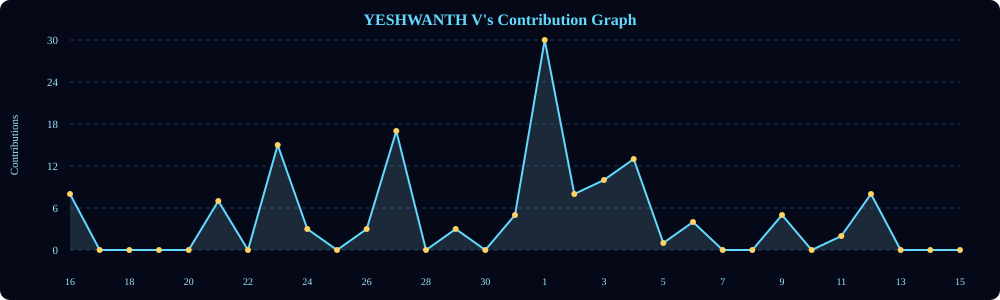

<div align="center">


<br/>


</div>

<br/>

## 🧭 01 · The Philosophy

I don't build to collect technologies. I build to understand systems.

<p align="center">
  
</p>

<div align="center">

**Observe → Build → Test → Learn → Ship → Repeat**

</div>

Every project is a different way of walking around that loop.

<br/>

## 👤 02 · Who I Am

**Yeshwanth V**
SWE Intern · AI/ML Engineer · Final Year CSE

📍 Bengaluru, India
🎓 Dr. Ambedkar Institute of Technology
🔭 Building across AI/ML · Full-Stack · Computer Vision · Systems · Edge

**What I care about**

<table width="100%">
  <tr>
    <td width="25%" align="center"><b>⚙️ Engineering</b><br/><sub>Clean architecture, useful abstractions, systems that survive real usage</sub></td>
    <td width="25%" align="center"><b>🧠 AI</b><br/><sub>Computer vision, applied ML, intelligent automation, retrieval, edge inference</sub></td>
    <td width="25%" align="center"><b>🚀 Products</b><br/><sub>Closing the loop between user → system → feedback</sub></td>
    <td width="25%" align="center"><b>📚 Learning</b><br/><sub>Understanding why something works, not just making it run</sub></td>
  </tr>
</table>

<br/>

## ⚙️ 03 · My Engineering Stack

<p align="center">
  
</p>

<table width="100%">
  <tr><td width="20%"><b>Frontend</b></td><td>React · Next.js · TypeScript · Tailwind</td></tr>
  <tr><td><b>Backend</b></td><td>FastAPI · Node.js · Flask · PostgreSQL · MongoDB</td></tr>
  <tr><td><b>AI / Vision</b></td><td>PyTorch · TensorFlow · XGBoost · OpenCV · MediaPipe · PaddleOCR</td></tr>
  <tr><td><b>Systems / Edge</b></td><td>C · C++ · Linux · ESP32 · Arduino · ONNX</td></tr>
  <tr><td><b>Delivery</b></td><td>Docker · Git · Vercel · Supabase · Firebase</td></tr>
</table>

<br/>

## 🚀 04 · What I'm Building Now

<table width="100%">
  <tr>
    <td width="50%" valign="top">
      <b>🏥 NearBy</b><br/>
      <sub>Co-Founder · Product / Full-Stack</sub><br/><br/>
      Medical-delivery platform being built from the ground up.<br/><br/>
      
      <br/><br/>
      <sub><b>Current direction:</b> MVP → pilot → real-world feedback</sub>
    </td>
    <td width="50%" valign="top">
      <b>🧾 APMC OCR Pipeline</b><br/>
      <sub>SWE Internship · Applied Computer Vision</sub><br/><br/>
      Turning difficult APMC documents into structured information.<br/><br/>
      
      
      <br/><br/>
      <sub><b>Current direction:</b> extraction → validation → reviewer feedback</sub>
    </td>
  </tr>
</table>

<br/>

## 📦 05 · Things I've Shipped

<table width="100%">
  <tr>
    <td width="50%" valign="top">
      <b>🎵 EchoTune</b><br/>
      Music app focused on reliable web/mobile playback.<br/><br/>
      
      
      <br/><br/>
      <sub>Web Audio API · Android build · foreground playback</sub>
    </td>
    <td width="50%" valign="top">
      <b>📧 MailPulse</b><br/>
      AI-powered Gmail triage assistant with voice summaries.<br/><br/>
      
      
      <br/><br/>
      <sub>Gmail OAuth2 · LLM classification · Kokoro TTS · Firestore</sub>
    </td>
  </tr>
</table>

<br/>

## 🧪 06 · Builds That Taught Me Something Difficult

The goal of these projects was not just to finish them. It was to understand the problem underneath them.

<table width="100%">
  <tr>
    <td width="33%" valign="top" align="center">
      <b>🧠 Cognitive Stress Detection</b><br/>
      <sub>Multimodal signal processing across face, voice, and biometrics.</sub><br/><br/>
      <sub><i>React · FastAPI · XGBoost · MediaPipe</i></sub>
    </td>
    <td width="33%" valign="top" align="center">
      <b>⚖️ Legal Case Priority ML</b><br/>
      <sub>Turning case information into a useful priority score.</sub><br/><br/>
      <sub><i>FastAPI · React · PostgreSQL · XGBoost</i></sub>
    </td>
    <td width="33%" valign="top" align="center">
      <b>🌍 FairLens</b><br/>
      <sub>Exploring social, behavioral, and ideological bias in AI systems.</sub><br/><br/>
      <sub><i>React · Gemini API · AIF360 · NetworkX</i></sub>
    </td>
  </tr>
  <tr>
    <td width="33%" valign="top" align="center">
      <b>🛡️ GRC · Kill the CAPTCHA</b><br/>
      <sub>Risk scoring and automated interaction signals.</sub><br/><br/>
      <sub><i>Chrome MV3 · JavaScript · ML</i></sub>
    </td>
    <td width="33%" valign="top" align="center">
      <b>🪐 ARTEMIS Rover Sim</b><br/>
      <sub>Navigation, pathfinding, sensor fusion, and 3D physics.</sub><br/><br/>
      <sub><i>Three.js · TensorFlow.js · Cannon.js</i></sub>
    </td>
    <td width="33%" valign="top" align="center">
      <b>🚗 Veyron</b><br/>
      <sub>Edge inference with tight latency constraints.</sub><br/><br/>
      <sub><i>MediaPipe · ONNX · ESP32 · FastAPI</i></sub>
    </td>
  </tr>
  <tr>
    <td width="33%" valign="top" align="center">
      <b>📄 Talk-to-PDF</b><br/>
      <sub>Retrieval-based question answering over documents.</sub><br/><br/>
      <sub><i>Cohere · ChromaDB · LangChain</i></sub>
    </td>
    <td width="33%" valign="top" align="center">
      <b>🔐 Smart Access Control</b><br/>
      <sub>Secure hardware communication and authentication.</sub><br/><br/>
      <sub><i>ESP32 · C++ · GSM · I²C</i></sub>
    </td>
    <td width="33%" valign="top" align="center">
      <b>🎓 Alma</b><br/>
      <sub>AI-assisted LMS pitched to real clients.</sub><br/><br/>
      <sub><i>React · FastAPI · Gemini API</i></sub>
    </td>
  </tr>
</table>

<br/>

## 📊 07 · The Work Behind the Profile

<p align="center">
  
  
</p>

<p align="center">
  
</p>

<details>
<summary><b>🏆 GitHub trophies</b></summary>
<p align="center">
  
</p>
</details>

<sub><i>Cards above are self-hosted via a scheduled GitHub Action (see <code>.github/workflows/update-stats.yml</code>) to avoid the shared Vercel rate limit — refreshed daily.</i></sub>

<br/>

## 🗺️ 08 · 2026 Roadmap

```
NOW
│
├── 🧾 APMC OCR
│   └── extraction → validation → reviewer feedback
│
├── 🏥 NearBy
│   └── MVP → pilot → real-world feedback
│
├── 🛡️ ConsentFlow
│   └── DPDP-focused consent management
│
└── 💼 Full-time SWE
    └── find a place where engineering depth matters


NEXT
│
├── ⚖️ Legal AI platform
├── 🌱 Open-source ML contributions
├── ✍️ Technical writing
└── 🔬 AI ethics research
```

**North star:** Build fewer demos. Build more systems that people can actually use.

<br/>

## 🧩 09 · How I Think About Engineering

A model is not a product.
A UI is not a product.
An API is not a product.
A clever algorithm is not a product.

A product is the whole loop:

**input → decision → action → feedback → improvement**

That is the kind of engineering I want to get better at.

<br/>

## 🌌 10 · One Last Thought

I don't want to know everything.

I want to become the engineer who can enter an unfamiliar system, trace the moving parts, understand why it behaves the way it does, change it without breaking everything, and leave it better than I found it.

<p align="center">
  <b>Build something.</b><br/>
  <sub>Then make the next version smarter.</sub>
</p>

<br/>

## 🤝 11 · Connect

<p align="center">
  <a href="mailto:yeshwanth9750@gmail.com"></a>
  <a href="https://linkedin.com/in/the-yesh21"></a>
  <a href="https://github.com/the-yesh21"></a>
  <a href="https://twitter.com/the_yesh21"></a>
</p>

<p align="center">
  <sub><i>Build with curiosity. Measure with honesty. Improve without ego.</i></sub>
</p>


